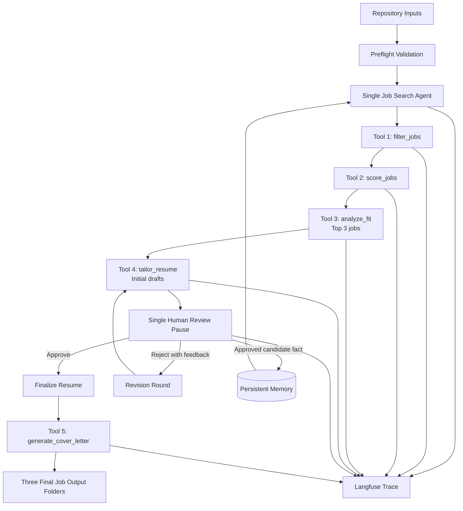

# EDS6397 Group 01 Job Search Agent

An evidence-grounded, single-agent workflow that filters and ranks AI/ML job postings, analyzes candidate-job fit, tailors resumes, pauses for Human Review, learns approved candidate facts, and generates one-page cover letters.

This project was developed for EDS 6397: Generative AI and Applications.

## Project Highlights

- One LLM agent orchestrates the complete workflow.
- Exactly five assignment-level tools are exposed to the model.
- Deterministic filtering and scoring select the Top 3 jobs.
- Resume and cover-letter claims must be supported by candidate, job, project, or approved-memory evidence.
- One continuous Human Review session supports up to two decision rounds.
- Candidate-approved facts persist in `memory.json`.
- Langfuse records the complete agent trace.
- Final resumes and cover letters are compiled as one-page PDFs.
- Typed schemas, state invariants, evidence validation, and output-safety checks guard the workflow.

## Architecture



## Single-Agent Design

The application uses one Ollama-backed LLM agent. The agent decides which of the five registered tools to call, supplies typed arguments, consumes structured tool results, and advances through a guarded workflow state machine.

The model does not directly write arbitrary files or call unrestricted functions. It can invoke only the tools registered in `AssignmentToolRegistry`.

The runtime enforces:

- Valid workflow phase transitions
- Maximum model-call and tool-call budgets
- Typed Pydantic tool arguments
- Job ID and revision-round consistency
- Evidence-grounded resume and cover-letter claims
- Protected resume-template regions
- One-page PDF constraints
- Safe output paths and overwrite protection

## Five Assignment Tools

| Tool | Responsibility |
|---|---|
| `filter_jobs` | Filters all loaded jobs using deterministic candidate preferences, including target titles, location, work mode, excluded companies, and experience constraints. |
| `score_jobs` | Deterministically scores accepted jobs and selects exactly three Top 3 opportunities. |
| `analyze_fit` | Produces an evidence-grounded fit analysis for one Top 3 job, including experience, seniority, education, skills, projects, gaps, and tailoring actions. |
| `tailor_resume` | Applies a typed, evidence-grounded resume edit plan and compiles a one-page tailored PDF. |
| `generate_cover_letter` | Produces an evidence-grounded, company-specific, one-page cover letter for an approved final resume. |

The implementation is located in:

```text
src/tools/
├── filtering.py
├── scoring.py
├── fit_analysis.py
├── resume_tailoring.py
└── cover_letter.py
```

The exact model-callable registry is defined in:

```text
src/agent/tool_registry.py
```

## Workflow

### 1. Preflight

Before the agent starts, preflight validates:

- Python version
- Required repository inputs
- The 20-job dataset
- Candidate profile and portfolio
- Candidate memory
- Base resume TEX and PDF
- `pdflatex`
- Ollama service and configured model
- Ollama chat completion
- Langfuse configuration
- Output-root safety

Run preflight with:

```powershell
python -m src preflight
```

### 2. Filtering and Scoring

The agent calls `filter_jobs` and then `score_jobs`.

Filtering applies the candidate's declared preferences. Scoring uses deterministic job, skill, experience, domain, and location evidence to rank accepted jobs and select exactly three Top 3 jobs.

### 3. Fit Analysis

The agent calls `analyze_fit` once for each Top 3 job.

Each analysis includes structured findings and evidence citations for:

- Relevant experience
- Seniority alignment
- Education alignment
- Core skill matches and gaps
- Portfolio-project relevance
- Recommended resume-tailoring actions

### 4. Resume Tailoring

The agent calls `tailor_resume` for each Top 3 job.

Allowed changes are constrained by a typed edit plan. The tool validates every proposed claim against available evidence, protects non-editable resume regions, compiles the LaTeX source, and rejects any result that exceeds one page.

### 5. Human Review

All three initial resume drafts enter one continuous Human Review pause.

The reviewer can:

- Approve a draft
- Reject a draft and provide revision instructions
- Add a candidate-approved fact to persistent memory

Rejected drafts may be revised during a second decision round. The workflow supports no more than two Human Review decision rounds.

Approved facts become available to later revisions during the same run and persist for future runs.

### 6. Cover Letters and Final Outputs

After all three resumes are approved, the agent calls `generate_cover_letter` once for each job.

The cover-letter tool verifies:

- Company-specific content
- Candidate and project claims
- Skill claims
- Evidence citations
- Consistency with the finalized resume
- One-page PDF length

The workflow then writes one completed output folder per Top 3 job.

## Persistent Memory

Persistent candidate memory is stored in:

```text
memory.json
```

Each fact records:

- Stable fact ID
- Fact type
- Candidate statement
- Normalized value
- Optional skill tags
- Evidence references
- Review provenance
- Actual UTC creation time
- Whether the fact was applied during the run

Only candidate-approved information should be added through Human Review.

The final verified run learned this fact:

```text
Cross-functional collaboration with product and engineering teams
```

## Repository Inputs

```text
candidate/
├── evidence_registry.json
├── memory_schema.json
├── portfolio.json
├── profile.json
├── sample_resume.pdf
└── sample_resume.tex

data/
└── AI_ML_Jobs_Dataset_20.csv

memory.json
```

The included candidate and job-search scenario are fictional and are provided for demonstration and evaluation.

## Output Structure

The final run creates exactly three completed job folders:

```text
outputs/
├── job-<top-job-id-1>/
├── job-<top-job-id-2>/
└── job-<top-job-id-3>/
```

Each completed job folder contains at minimum:

```text
job_details.json
fit_analysis.json
resume_before.pdf
resume_after.pdf
resume_change_log.json
cover_letter.pdf
cover_letter_evidence.json
```

Generated LaTeX source files may also be retained with the final artifacts.

Runtime-only files such as `outputs/.runtime` and Human Review completion markers are not part of the final submission.

## Installation

### Prerequisites

- Python 3.10 or later
- Ollama
- A locally installed tool-capable Ollama model
- MiKTeX or another LaTeX distribution providing `pdflatex`
- Git
- Optional Langfuse account for observability

The final verified environment used Python 3.13.2 and the local model:

```text
qwen3-tools-fixed:8b
```

### Create the Virtual Environment

```powershell
python -m venv .venv
.\.venv\Scripts\Activate.ps1
python -m pip install --upgrade pip
pip install -r requirements.txt
```

### Configure Environment Variables

Create a local `.env` from the provided example:

```powershell
Copy-Item .env.example .env
```

Important settings include:

```dotenv
OLLAMA_HOST=http://localhost:11434
OLLAMA_MODEL=qwen3:8b
OLLAMA_NUM_CTX=8192
OLLAMA_NUM_PREDICT=2048
OLLAMA_REQUEST_TIMEOUT_SECONDS=600
OLLAMA_TEMPERATURE=0

LANGFUSE_ENABLED=false
LANGFUSE_PUBLIC_TRACE=false
LANGFUSE_PUBLIC_KEY=
LANGFUSE_SECRET_KEY=
LANGFUSE_BASE_URL=https://us.cloud.langfuse.com
```

Set `OLLAMA_MODEL` to a model already installed in the local Ollama service.

Never commit `.env`, Langfuse secret keys, or other credentials.

## Running the Agent

First ensure Ollama is running and the configured model is available.

Run all preflight checks:

```powershell
python -m src preflight
```

Start the complete workflow:

```powershell
python -m src run
```

Bypass only the initial start confirmation:

```powershell
python -m src run --yes
```

The `--yes` option does not bypass Human Review.

View all available options:

```powershell
python -m src run --help
```

Custom inputs can be supplied through options such as:

```text
--jobs
--profile
--portfolio
--evidence
--base-resume-tex
--base-resume-pdf
--memory
--output-root
--max-model-calls
--max-tool-calls
```

Use `--skip-preflight` only when service checks have already been completed. Path validation and overwrite protection remain active.

## Testing

Run the complete test suite with:

```powershell
python -m pytest -q
```

Final verified result:

```text
295 passed in 63.61s
```

The tests cover configuration, input loading, deterministic tools, evidence validation, resume and cover-letter generation, Human Review, persistent memory, tracing, output safety, and end-to-end runtime behavior.

## Observability with Langfuse

When Langfuse is enabled, the workflow records:

- One root agent trace
- Model generations
- Tool calls
- Workflow spans
- Human Review pause and decisions
- Memory writes
- Resume revision rounds
- Cover-letter generation
- Final run result

### Final Verified Public Trace

- Run ID: `run-8aed55694f044b749cb2bf1f5753db1c`
- Trace ID: `9f30f905dc3557887ae384a93c92cfdf`
- Model calls: `13`
- Tool calls: `13`
- Invalid tool attempts: `0`
- Human Review pauses: `1`
- Learned memory facts: `1`
- Final resumes: `3`
- Cover letters: `3`

Public trace:

https://us.cloud.langfuse.com/project/cmrpjxygx038lad0j7x3jo064/traces/9f30f905dc3557887ae384a93c92cfdf

## Final Verified Top 3

The final run selected:

1. Chickasaw Nation Industries — AI Engineer
2. Camden Property Trust — AI Engineer, Camden Corporate Office
3. Flash AI — AI Engineer

All three final job folders passed output validation:

- Required files present
- JSON files parse successfully
- Resume-before PDFs are one page
- Resume-after PDFs are one page
- Cover-letter PDFs are one page
- No zero-byte required files
- No invalid tool attempts in the final run

## Project Structure

```text
src/
├── agent/
│   ├── client.py
│   ├── prompts.py
│   ├── runtime.py
│   ├── state.py
│   └── tool_registry.py
├── models/
├── observability/
│   └── tracing.py
├── services/
│   ├── candidate_loader.py
│   ├── jobs_loader.py
│   ├── memory_loader.py
│   ├── memory_store.py
│   ├── output_writer.py
│   ├── preflight.py
│   └── resume_finalizer.py
├── tools/
│   ├── filtering.py
│   ├── scoring.py
│   ├── fit_analysis.py
│   ├── resume_tailoring.py
│   └── cover_letter.py
├── workflow/
│   ├── console_review.py
│   └── human_review.py
├── cli.py
├── config.py
└── __main__.py
```

## Security and Safety Notes

- `.env` is excluded by `.gitignore`.
- Tool arguments reject unexpected fields.
- Private chain-of-thought requests are rejected from tool decision summaries.
- Resume and cover-letter claims require authorized evidence.
- Output locations are validated before writing.
- Existing completed output files are protected from accidental overwrite.
- Runtime artifacts should be removed before committing final outputs.
- Langfuse public visibility should be enabled only for traces intended for submission.

## License and Academic Use

This repository is an academic course project. Candidate information and the included job-search scenario are fictional. Review the repository and generated artifacts before adapting the workflow for real employment decisions.
